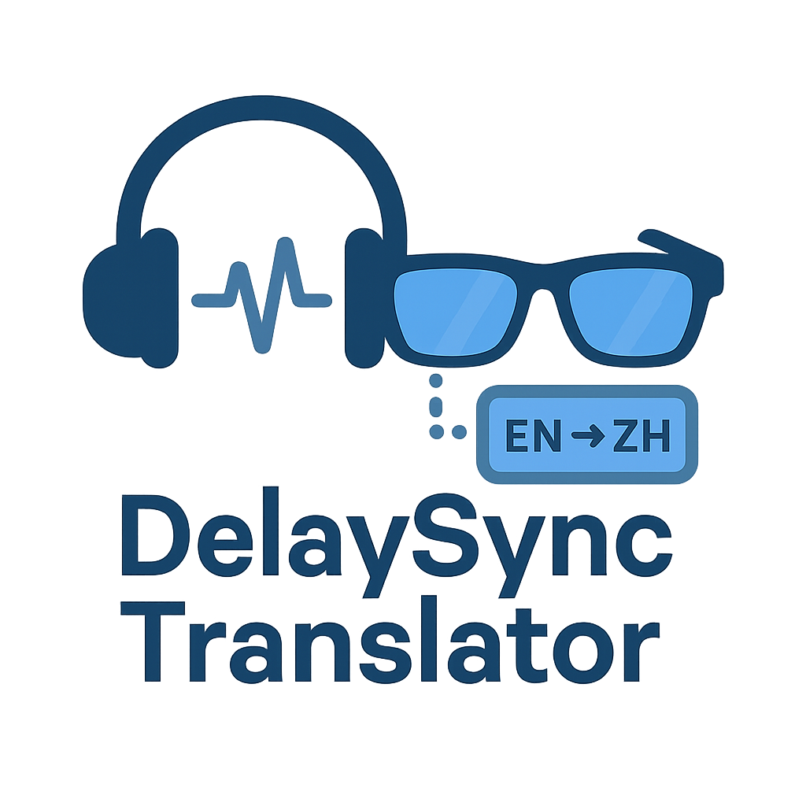
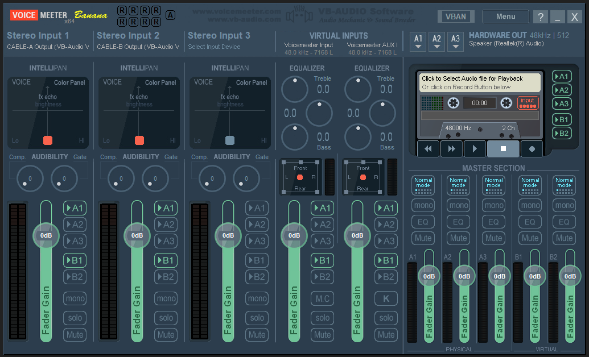
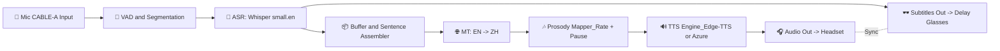

# 🎧🕶️ 延时眼镜与实时翻译耳机同步系统

*Delay Glasses & Real-Time Translation Headset Synchronization System*

<p align="center">
  
</p>

<p align="center">
  <b>⏳ 同声传译不再“抢跑”，字幕与语音延时精准同步</b>  
</p>

---

## 📖 项目简介 | Project Introduction

本项目是一个 **延时眼镜与实时翻译耳机同步系统**，实现了 **语音识别（ASR）→ 机器翻译（MT）→ 语音合成（TTS）** 的完整闭环，并通过 **延时控制与韵律映射**，让字幕与语音在不同设备（眼镜、耳机）中精准同步。

This project is a **Delay Glasses & Real-Time Translation Headset Synchronization System**, which achieves a full pipeline of **ASR → MT → TTS** and leverages **delay control and prosody mapping** to synchronize subtitles (on glasses) and translated audio (on headset).

---

## 🔑 核心功能 | Key Features

* **🎤 语音输入与分段 (VAD)**：智能分割语音，减少误触发。
* **📝 高精度语音识别 (ASR)**：基于 *Whisper* 模型，低延迟识别英文语音。
* **🌐 实时翻译 (MT)**：英 → 中 实时翻译，支持多语言扩展。
* **🎶 韵律控制 (Prosody Mapper)**：保留停顿、语速等自然特征，提升可听度。
* **🔊 高质量合成 (TTS)**：支持 *Edge-TTS / Azure TTS*，自然流畅。
* **🕶️ 延时字幕 (Delay Glasses)**：字幕显示与音频播放同步。
* **⚡ 多模态同步**：实现 *字幕延时* 与 *音频翻译* 严格对齐。

---

## 🖼️ 系统演示 | Screenshots & Demo

### 界面截图 | Screenshot

<p align="center">
  
</p>

### 动态演示 | Demo GIF

<p align="center">
  
</p>

*左：眼镜字幕延时显示；右：耳机同步语音翻译*

---

## 🏗️ 系统架构 | Architecture



```
+----------------+       UDP/JSON       +------------------+
|  翻译耳机模拟   | <------------------->|   延时眼镜模拟    |
| Earbud Sim     |                      | Glasses Sim      |
|                |                      |                  |
| - 翻译延迟计算  |                      | - 视频缓冲管理    |
| - TTS播放      |                      | - 延迟显示控制    |
| - 延迟参数发送  |                      | - 环境自适应调节  |
+----------------+                      +------------------+
       ↑                                          ↑
       |                                          |
   麦克风采音                                  手机摄像头推流
```

| 翻译耳机模拟       |UDP/JSON     |
| Earbud Sim           |-------------|
| 翻译延迟计算       | \~0.8s      |
| TTS播放             | \~1.2s      |
| 延迟参数发送       | \~2.5s      |

|                |       UDP/JSON       |                |
|  翻译耳机模拟   | <------------------->|   延时眼镜模拟    |
| Earbud Sim     |                      | Glasses Sim      |
|                |                      |                  |
|   翻译延迟计算  |                      |   视频缓冲管理    |
|   TTS播放      |                      |   延迟显示控制    |
|   延迟参数发送  |                      |   环境自适应调节  |
|----------------|                      |------------------|
       ↑                                          ↑
       |                                          |
   麦克风采音                                  手机摄像头推流
   
   

|                |     
| Earbud Sim     |                    
|                |                     
|   翻译延迟计算  |                    
|   延迟参数发送  |                     
|----------------|                    
       ↑                                          ↑
       |                                          |
   麦克风采音                                  手机摄像头推流   
   
  


  

| Model       | Avg Latency | Translation Completeness | GPU      |
| ----------- | ----------- | ------------------------ | -------- |
| `tiny.en`   | \~0.8s      | Medium                   | Optional |
| `small.en`  | \~1.2s      | High                     | ✅        |
| `medium.en`  | \~2.5s      | Very High                | ✅        |

---

---

## 📂 项目结构 | Project Structure

```
.
├── docs/                 # 文档与设计说明
├── src/                  # 核心代码
│   ├── asr/              # Whisper-based ASR 模块
│   ├── mt/               # 翻译模块
│   ├── tts/              # TTS 合成模块
│   ├── sync/             # 延时与同步模块
│   └── ui/               # 可视化字幕输出
├── tests/                # 单元与集成测试
├── assets/               # Logo / 图标 / 架构图
├── requirements.txt      # 依赖
└── README.md             # 工程说明
```

---

## ⚙️ 技术栈 | Tech Stack

* **ASR**：OpenAI Whisper (small.en)
* **MT**：自研轻量级 EN→ZH 翻译器（可切换至 DeepL API / Azure Translator）
* **TTS**：Edge-TTS / Azure Speech Service
* **同步机制**：自定义 Buffer + 时间戳对齐
* **硬件支持**：延时眼镜（字幕投影） + 蓝牙耳机

---

## 🚀 安装与运行 | Installation & Usage

```bash
# 克隆项目
git clone https://github.com/yourname/DelaySync_Translator.git
cd DelaySync_Translator
```

# 安装依赖
pip install -r requirements.txt

# 手机端配置

* 安装 **IP Webcam**（安卓）或 **Iriun Webcam**（iOS/安卓）
* 确保手机与电脑在同一局域网
* 启动推流并记下视频流地址：

  * HTTP/MJPEG: `http://<手机IP>:8080/video`
  * RTSP/H.264: `rtsp://<手机IP>:<端口>/<路径>`

# 启动延时眼镜端

```bash
python glasses_sim.py --video "http://<手机IP>:8080/video"
```

* `<手机IP>` 可在手机端推流应用界面查看
* 程序启动后，可用 **↑/↓** 动态调节延迟（单位：100ms），按 `q` 退出

# 启动翻译耳机端

```bash
python prosody_tts_vm.py --model small.en --voice zh-CN-YunxiNeural
```

* `--delay_ms` 设定延迟时间（毫秒）
* `--text` 为播放的翻译文本


运行后：

* 🎧 耳机会播放翻译语音（延迟匹配字幕）
* 🕶️ 智能眼镜显示延时字幕

| 参数                  | 说明                    |
| ------------------- | --------------------- |
| `--device-name`     | 捕获系统音频输入设备            |
| `--tts_device_name` | 输出翻译语音的设备             |
| `--whisper`         | 选择 ASR 模型             |
| `--lead_ms`         | 翻译缓冲时间，控制延迟与完整度       |
| `--tts_rate_pct`    | 调节语速，如 -15 表示比正常慢 15% |
| `--keep_wav`        | 是否保存合成语音日志            |
| `--wav_dir`         | 保存目录                  |

---

## 📊 Performance | 性能指标

| Model       | Avg Latency | Translation Completeness | GPU      |
| ----------- | ----------- | ------------------------ | -------- |
| `tiny.en`   | \~0.8s      | Medium                   | Optional |
| `small.en`  | \~1.2s      | High                     | ✅        |
| `medium.en` | \~2.5s      | Very High                | ✅        |

---

## 📂 项目结构

```
DelaySync_Translator_Demo/
│── earbud_sim.py           # 翻译耳机模拟端（延迟播放翻译音频）
│── glasses_sim.py          # 延时眼镜模拟端（延迟显示视频画面）
│── common.py               # 公共配置与工具函数
│── prosody_tts_vm.py       # 翻译耳机模拟端（延迟播放翻译音频）
│── requirements.txt        # Python 依赖清单
│── README.md               # 项目说明文档（GitHub 主页展示）
│
├── /screenshots/           # 演示截图
│   ├── demo_screenshot.png     # 系统运行画面
│   ├── delay_adjust.png        # 动态调节延迟界面
│   ├── phone_stream.png        # 手机推流界面
│
├── /docs/                  # 附加文档
│   ├── technical_disclosure.pdf  # 技术交底书
│   ├── workflow_diagram.png      # 系统流程图
│   ├── architecture.png          # 系统架构图
│
├── /examples/              # 示例脚本
│   ├── example_run.sh          # Linux/Mac 一键运行脚本
│   ├── example_run.bat         # Windows 一键运行脚本
│
└── /data/                  # 测试数据
    ├── sample_audio.wav        # 示例音频
    ├── sample_video.mp4        # 示例视频
```

---

## 🚀 应用场景 | Application Scenarios

* 🌐 **跨国会议**：保证字幕与语音同步，不再“抢跑”
* 🧑‍🏫 **国际课堂教学**：学生可通过眼镜+耳机同步获取翻译内容
* 🧳 **出国旅行**：实时翻译 + 字幕显示，提升交流体验
* 🦻 **听障人士辅助**：字幕延时对齐，提升可读性

架构可扩展至多语种翻译、AR字幕叠加、3D嘴型合成等高级功能，具有商业化潜力。

---

## 🔮 Roadmap | 后续扩展

* Multi-language support (中 ↔ 英, 日 ↔ 中, etc.)
* Real-time meeting summarization with LLM
* Adaptive prosody control for speaker style simulation
* Enhanced fault-tolerance & auto-reconnection

---


## 📑 专利支撑 | Patent Support

本系统对应于 **延时眼镜与实时翻译耳机同步系统** 专利。

---

## 🤝 致谢 | Acknowledgments

* [Whisper](https://github.com/openai/whisper) for ASR
* [Edge-TTS](https://github.com/rany2/edge-tts) for TTS
* [Voicemeeter](https://vb-audio.com/Voicemeeter/) for audio routing
* Contributors & collaborators of this project

---

## 🤝 贡献 | Contribution

欢迎提交 PR、Issue 或优化建议。

---

💡 *With Delay Glasses + Translation Headset, we make real-time interpretation synchronized and natural.*
