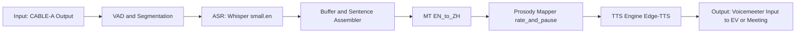

# 🎧 Prosody-Aware Real-Time Speech Translation

*中英文实时同声传译系统 (带韵律映射)*

<p align="center">
  
</p>

<p align="center">
  <b>⚡ Low-latency | 🎙 Real-time Speech Recognition | 🌍 English→Chinese Translation | 🔊 Natural TTS with Prosody</b>
</p>

---

## 📸 Screenshots & Demo

<p align="center">
  
</p>

<p align="center">
  
</p>

---

## 🚀 Introduction | 项目简介

**Prosody-Aware Real-Time Speech Translation** is an **end-to-end live interpreter system** that combines:

* 🎤 **ASR (Speech Recognition)** → Captures English speech in real time
* 🌐 **MT (Machine Translation)** → Translates into fluent Chinese text
* 🔊 **TTS (Speech Synthesis)** → Generates natural Mandarin speech with **prosody mapping** (语速 & 停顿保持)

该系统通过 **虚拟音频线 (Voicemeeter)** 与任意会议软件无缝集成，可广泛应用于：

* 国际会议同声传译
* 在线课程/远程教育
* 跨国企业会议
* 新闻/学术直播

---

## 🏗 Architecture | 系统架构



```mermaid
flowchart LR
  A[🎤 Input: CABLE-A Output] --> B[🔎 VAD & Segmentation];
  B --> C[📝 ASR: Whisper small.en];
  C --> D[📦 Buffer & Sentence Assembler];
  D --> E[🌐 MT: EN → ZH];
  E --> F[🎶 Prosody Mapper (语速/停顿调整)];
  F --> G[🔊 TTS Engine (Azure / Local)];
  G --> H[🎧 Output: Voicemeeter Input → Meeting Software];

```
---

## ⚙️ Installation | 安装

```bash
git clone https://github.com/yourname/prosody-tts-vm.git
cd prosody-tts-vm
pip install -r requirements.txt
```

Dependencies:

* `torch` + CUDA (optional, for faster ASR)
* `whisper`
* `sounddevice`
* `pyaudio`
* `requests` (Azure TTS)

---

## 🎯 Usage | 使用方法

```bash
python prosody_tts_vm.py \
  --mode live \
  --device-name "CABLE-A Output" \
  --tts_device_name "Voicemeeter Input (VB-Audio Voicemeeter VAIO)" \
  --whisper small.en \
  --lead_ms 1200 \
  --voice zh-CN-YunxiNeural \
  --tts_rate_pct -15 \
  --keep_wav --wav_dir ./wav_logs
```

| 参数                  | 说明                    |
| ------------------- | --------------------- |
| `--device-name`     | 捕获系统音频输入设备            |
| `--tts_device_name` | 输出翻译语音的设备             |
| `--whisper`         | 选择 ASR 模型             |
| `--lead_ms`         | 翻译缓冲时间，控制延迟与完整度       |
| `--tts_rate_pct`    | 调节语速，如 -15 表示比正常慢 15% |
| `--keep_wav`        | 是否保存合成语音日志            |
| `--wav_dir`         | 保存目录                  |

---

## 📊 Performance | 性能指标

| Model       | Avg Latency | Translation Completeness | GPU      |
| ----------- | ----------- | ------------------------ | -------- |
| `tiny.en`   | \~0.8s      | Medium                   | Optional |
| `small.en`  | \~1.2s      | High                     | ✅        |
| `medium.en` | \~2.5s      | Very High                | ✅        |

---

## 🌟 Features | 工程亮点

* **Real-time + Robust** → Avoids missing sentences with **buffer + VAD**
* **Prosody Mapping** → Keeps rhythm & speech style
* **Scalable** → Replaceable ASR / MT / TTS backends
* **Debuggable** → Logs original audio, ASR text, translations, and TTS output

---

## 📂 Project Structure | 项目结构

```
prosody_tts_vm/
├── prosody_tts_vm.py     # Main program
├── requirements.txt      # Dependencies
├── /wav_logs             # Audio logs
├── /assets               # Logo, screenshots, GIFs
└── README.md             # Documentation
```

---

## 🔮 Roadmap | 后续扩展

* Multi-language support (中 ↔ 英, 日 ↔ 中, etc.)
* Real-time meeting summarization with LLM
* Adaptive prosody control for speaker style simulation
* Enhanced fault-tolerance & auto-reconnection


