# 🎧🕶️ 延时眼镜与实时翻译耳机同步系统

*Delay Glasses & Real-Time Translation Headset Synchronization System*

<p align="center">
  
</p>

<p align="center">
  <b>⏳ 同声传译不再“抢跑”，字幕与语音延时精准同步</b>  
</p>

---

## 📖 项目简介 | Project Introduction

本项目是一个 **延时眼镜与实时翻译耳机同步系统**，实现了 **语音识别（ASR）→ 机器翻译（MT）→ 语音合成（TTS）** 的完整闭环，并通过 **延时控制与韵律映射**，让字幕与语音在不同设备（眼镜、耳机）中精准同步。

This project is a **Delay Glasses & Real-Time Translation Headset Synchronization System**, which achieves a full pipeline of **ASR → MT → TTS** and leverages **delay control and prosody mapping** to synchronize subtitles (on glasses) and translated audio (on headset).

---

## 🔑 核心功能 | Key Features

* **🎤 语音输入与分段 (VAD)**：智能分割语音，减少误触发。
* **📝 高精度语音识别 (ASR)**：基于 *Whisper* 模型，低延迟识别英文语音。
* **🌐 实时翻译 (MT)**：英 → 中 实时翻译，支持多语言扩展。
* **🎶 韵律控制 (Prosody Mapper)**：保留停顿、语速等自然特征，提升可听度。
* **🔊 高质量合成 (TTS)**：支持 *Edge-TTS / Azure TTS*，自然流畅。
* **🕶️ 延时字幕 (Delay Glasses)**：字幕显示与音频播放同步。
* **⚡ 多模态同步**：实现 *字幕延时* 与 *音频翻译* 严格对齐。

---

## 🖼️ 系统演示 | Screenshots & Demo

### 界面截图 | Screenshot

<p align="center">
  
</p>

### 动态演示 | Demo GIF

<p align="center">
  
</p>

*左：眼镜字幕延时显示；右：耳机同步语音翻译*

---

## 🏗️ 系统架构 | Architecture

```mermaid
flowchart LR
  A[🎤 Mic CABLE-A Input] --> B[🔎 VAD and Segmentation]
  B --> C[📝 ASR: Whisper small.en]
  C --> D[📦 Buffer and Sentence Assembler]
  D --> E[🌐 MT: EN -> ZH]
  E --> F[🎶 Prosody Mapper_Rate + Pause]
  F --> G[🔊 TTS Engine_Edge-TTS or Azure]
  G --> H[🎧 Audio Out -> Headset]
  C --> I[🕶️ Subtitles Out -> Delay Glasses]
  H -. Sync .- I
```



---

## 📂 项目结构 | Project Structure

```
.
├── docs/                 # 文档与设计说明
├── src/                  # 核心代码
│   ├── asr/              # Whisper-based ASR 模块
│   ├── mt/               # 翻译模块
│   ├── tts/              # TTS 合成模块
│   ├── sync/             # 延时与同步模块
│   └── ui/               # 可视化字幕输出
├── tests/                # 单元与集成测试
├── assets/               # Logo / 图标 / 架构图
├── requirements.txt      # 依赖
└── README.md             # 工程说明
```

---

## ⚙️ 技术栈 | Tech Stack

* **ASR**：OpenAI Whisper (small.en)
* **MT**：自研轻量级 EN→ZH 翻译器（可切换至 DeepL API / Azure Translator）
* **TTS**：Edge-TTS / Azure Speech Service
* **同步机制**：自定义 Buffer + 时间戳对齐
* **硬件支持**：延时眼镜（字幕投影） + 蓝牙耳机

---

## ⚙️ 安装与运行 | Installation & Usage

```bash
# 克隆项目
git clone https://github.com/yourname/DelaySync_Translator.git
cd DelaySync_Translator

# 安装依赖
pip install -r requirements.txt

# 运行示例
python prosody_tts_vm.py --model small.en --voice zh-CN-YunxiNeural
```

运行后：

* 🎧 耳机会播放翻译语音（延迟匹配字幕）
* 🕶️ 智能眼镜显示延时字幕

---

## 🚀 应用场景 | Application Scenarios

* 🌐 **跨国会议**：保证字幕与语音同步，不再“抢跑”
* 🧑‍🏫 **国际课堂教学**：学生可通过眼镜+耳机同步获取翻译内容
* 🧳 **出国旅行**：实时翻译 + 字幕显示，提升交流体验
* 🦻 **听障人士辅助**：字幕延时对齐，提升可读性

---

## 📑 专利支撑 | Patent Support

本系统对应于 **延时眼镜与实时翻译耳机同步系统** 专利。

---

## 🤝 致谢 | Acknowledgments

* [Whisper](https://github.com/openai/whisper) for ASR
* [Edge-TTS](https://github.com/rany2/edge-tts) for TTS
* [Voicemeeter](https://vb-audio.com/Voicemeeter/) for audio routing
* Contributors & collaborators of this project

---

## 🤝 贡献 | Contribution

欢迎提交 PR、Issue 或优化建议。

---

💡 *With Delay Glasses + Translation Headset, we make real-time interpretation synchronized and natural.*
